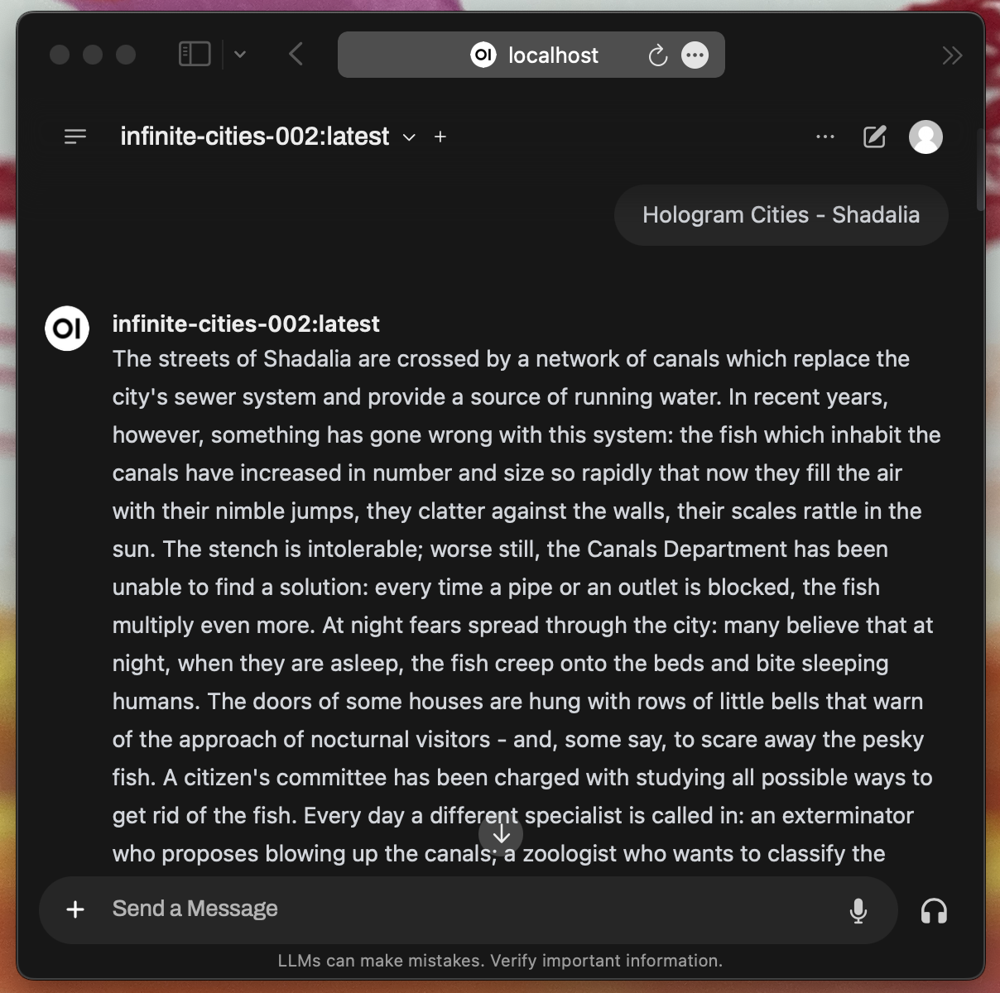

**TLDR; Fine-tune an LLM to imitate a dead author! Examples** <a class="text-slate-700 dark:text-slate-300 hover:text-rainbow font-semibold" href='/tag/infinite cities'>here</a>.

This is the second part of my experiment. See [part 1](../italo-calvino-infinite-cities-pt1) for environment setup and data pre-processing.

## Project Structure refresher
Here's our project structure again for reference:
```shell
your_project/
├── .venv/ # Ignore, uv will manage this
├── .git/ # Ignore, git will manage this
├── .gitignore # Add anything you don't want to track with git
├── .python-version # Ignore, uv will manage this
├── dataset_preparation.py # *Created in part 1*
├── fine_tune_model.py # TBC
├── invisible_cities.csv # Raw training data
├── training_data.csv # Formatted training data with 'input' and 'output' columns
├── train_dataset/ # *Generated by dataset_preparation.py in part 1*
├── eval_dataset/ # *Generated by dataset_preparation.py in part 1*
├── fine-tune-01/ # Generated by peft_fine_tune_model.py
├── .pyproject.toml # Mostly ignore. This is uv's list of project requirements
└── uv.lock # Ignore, uv will manage this
```

## Fine-Tuning the Model

With our dataset prepared, it's time to embark on fine-tuning the language model to generate "infinite cities." We'll use `fine_tune_model.py`, which leverages [Parameter-Efficient Fine-Tuning](https://huggingface.co/docs/peft/main/en/index) (PEFT) using [Low-Rank Adaptation](https://huggingface.co/docs/peft/main/en/conceptual_guides/lora) (LoRA). This approach allows us to fine-tune large models on hardware with relatively limited resources compared to the server-farms full of A/H100s the megacorps have access to.

Here's the script:

```python
# fine_tune_model.py

import torch
from datasets import load_from_disk
from transformers import (
    AutoTokenizer,
    AutoModelForCausalLM,
    Trainer,
    TrainingArguments,
    DataCollatorForLanguageModeling
)
from peft import get_peft_model, LoraConfig, TaskType
from tqdm import tqdm

# Training iteration
iteration = "01"  # To keep track of multiple tuning iterations

# Set the device (MPS - Metal Performance Shaders)
device = torch.device('mps' if torch.backends.mps.is_available() else 'cpu')

# Load the datasets
train_dataset = load_from_disk('train_dataset')
eval_dataset = load_from_disk('eval_dataset')

# Use a smaller model
model_name = '/path/to/Mistral-7B-v0.3'  # Adjust the path to your model
tokenizer = AutoTokenizer.from_pretrained(model_name)

# Ensure the tokenizer has a padding token
if tokenizer.pad_token is None:
    tokenizer.pad_token = tokenizer.eos_token

model = AutoModelForCausalLM.from_pretrained(model_name).to(device)

model.enable_input_require_grads()

# Apply PEFT with LoRA
peft_config = LoraConfig(
    task_type=TaskType.CAUSAL_LM,
    inference_mode=False,
    r=4,
    lora_alpha=16,
    lora_dropout=0.1
)
model = get_peft_model(model, peft_config)

# Enable gradient checkpointing
model.gradient_checkpointing_enable()

# Verify model parameters require gradients
for name, param in model.named_parameters():
    print(f"{name}: requires_grad={param.requires_grad}")

# Tokenization function
def tokenize_function(examples):
    inputs = []
    for i in tqdm(range(len(examples['input'])), desc='Tokenizing'):
        prompt = examples['input'][i]
        response = examples['output'][i]
        full_text = prompt + '\n' + response
        inputs.append(full_text)
    
    tokenized_outputs = tokenizer(
        inputs,
        truncation=True,
        max_length=512,  # Increased max_length to 512
        padding='max_length',
    )
    tokenized_outputs['labels'] = tokenized_outputs['input_ids'].copy()
    return tokenized_outputs

# Tokenize the datasets
tokenized_train = train_dataset.map(
    tokenize_function,
    batched=True,
    remove_columns=['input', 'output'],
    desc='Tokenizing Training Dataset'
)

tokenized_eval = eval_dataset.map(
    tokenize_function,
    batched=True,
    remove_columns=['input', 'output'],
    desc='Tokenizing Evaluation Dataset'
)

# Initialize data collator
data_collator = DataCollatorForLanguageModeling(
    tokenizer=tokenizer,
    mlm=False,
)

# Set up training arguments
training_args = TrainingArguments(
    output_dir='./results-' + iteration,
    eval_strategy='steps',
    eval_steps=500,
    save_steps=500,
    logging_steps=100,
    num_train_epochs=3,
    per_device_train_batch_size=1,  # Adjusted batch size
    per_device_eval_batch_size=1,
    gradient_accumulation_steps=4,
    learning_rate=5e-5,
    weight_decay=0.0,
    save_total_limit=2,
    fp16=False,  # Disable fp16 mixed precision
    bf16=True,   # Enable bf16 mixed precision
)

# Initialize the Trainer
trainer = Trainer(
    model=model,
    args=training_args,
    train_dataset=tokenized_train,
    eval_dataset=tokenized_eval,
    data_collator=data_collator,
)

# Start training
trainer.train()

# Save the fine-tuned model
trainer.save_model('./fine-tune-' + iteration)
tokenizer.save_pretrained('./fine-tune-' + iteration)
```

Let's walk through the script step by step.

**Importing Libraries**

```python
import torch
from datasets import load_from_disk
from transformers import (
    AutoTokenizer,
    AutoModelForCausalLM,
    Trainer,
    TrainingArguments,
    DataCollatorForLanguageModeling
)
from peft import get_peft_model, LoraConfig, TaskType
from tqdm import tqdm
```

- **torch**: For tensor operations and handling the device (CPU or GPU).
- **datasets**: To load our preprocessed, efficient datasets from disk.
- **transformers**: Provides the model, tokenizer, and training utilities from Hugging Face.
- **peft**: Implements parameter-efficient fine-tuning methods like LoRA.
- **tqdm**: For progress bars during tokenization and fine-tuning.

**Setting Up the Training Iteration and Device**

```python
iteration = "01"  # To keep track of multiple tuning iterations

device = torch.device('mps' if torch.backends.mps.is_available() else 'cpu')
```

- **iteration**: A variable to keep track of training runs, useful if you plan to fine-tune the model multiple times with different settings.
- **device**: Sets the computation device. If you have an Apple Silicon Mac, it utilizes the Metal Performance Shaders (MPS); otherwise, it defaults to the CPU.

**Loading the Datasets**

```python
train_dataset = load_from_disk('train_dataset')
eval_dataset = load_from_disk('eval_dataset')
```

We load the training and evaluation datasets we prepared earlier.

**Loading the Model and Tokenizer**

```python
model_name = '/path/to/Mistral-7B-v0.3'  # Adjust the path to your model
tokenizer = AutoTokenizer.from_pretrained(model_name)

if tokenizer.pad_token is None:
    tokenizer.pad_token = tokenizer.eos_token

model = AutoModelForCausalLM.from_pretrained(model_name).to(device)
```

- **model_name**: Path to the pre-trained model. Make sure to adjust it to where your model is located.
- **tokenizer**: Loads the tokenizer associated with Mistral-7B.
- **Padding Token**: Ensures the tokenizer has a padding token. If it doesn't, we set it to the end-of-sequence token.
- **model**: Loads the pre-trained causal language model and moves it to the specified device, in this case my M2's GPU VRAM.

**Enabling Gradient Computation on Input Embeddings**

```python
model.enable_input_require_grads()
```

This enables gradient computation on the input embeddings, necessary for fine-tuning.

**Applying PEFT with LoRA**

```python
peft_config = LoraConfig(
    task_type=TaskType.CAUSAL_LM,
    inference_mode=False,
    r=4,
    lora_alpha=16,
    lora_dropout=0.1
)
model = get_peft_model(model, peft_config)
```

- **peft_config**: Configures the LoRA settings.
  - **task_type**: Specifies the task; in this case, causal language modeling.
  - **inference_mode**: Set to `False` since we're training, not just inferring.
  - **r, lora_alpha, lora_dropout**: Hyperparameters controlling the adaptation.
- **get_peft_model**: Wraps our model with the PEFT configuration.

**Enabling Gradient Checkpointing**

```python
model.gradient_checkpointing_enable()
```

Enables gradient checkpointing to save memory during training by not storing all intermediate activations.

**Verifying Model Parameters**

```python
for name, param in model.named_parameters():
    print(f"{name}: requires_grad={param.requires_grad}")
```

This loop prints out which parameters require gradients, helping us verify that only the intended parts of the model are being updated.

**Tokenization Function**

```python
def tokenize_function(examples):
    inputs = []
    for i in tqdm(range(len(examples['input'])), desc='Tokenizing'):
        prompt = examples['input'][i]
        response = examples['output'][i]
        full_text = prompt + '\n' + response
        inputs.append(full_text)
    
    tokenized_outputs = tokenizer(
        inputs,
        truncation=True,
        max_length=512,  # Increased max_length to 512
        padding='max_length',
    )
    tokenized_outputs['labels'] = tokenized_outputs['input_ids'].copy()
    return tokenized_outputs
```

- **Concatenating Prompt and Response**: For each example, we combine the prompt and the response, separated by a newline.
- **Tokenization**: Tokenizes the combined text with a maximum length of 512 tokens, truncating and padding as necessary.
- **Labels**: Sets the labels for training; since we're doing language modeling, the labels are the same as the input IDs.

**Tokenizing the Datasets**

```python
tokenized_train = train_dataset.map(
    tokenize_function,
    batched=True,
    remove_columns=['input', 'output'],
    desc='Tokenizing Training Dataset'
)

tokenized_eval = eval_dataset.map(
    tokenize_function,
    batched=True,
    remove_columns=['input', 'output'],
    desc='Tokenizing Evaluation Dataset'
)
```

We apply the tokenization function to both the training and evaluation datasets.

**Initializing the Data Collator**

```python
data_collator = DataCollatorForLanguageModeling(
    tokenizer=tokenizer,
    mlm=False,
)
```

- **Data Collator**: Prepares batches of data during training.
- **mlm=False**: Indicates we're not using masked language modeling but causal language modeling.

**Setting Up Training Arguments**

```python
training_args = TrainingArguments(
    output_dir='./results-' + iteration,
    eval_strategy='steps',
    eval_steps=500,
    save_steps=500,
    logging_steps=100,
    num_train_epochs=3,
    per_device_train_batch_size=1,  # Adjusted for limited hardware
    per_device_eval_batch_size=1,
    gradient_accumulation_steps=4,
    learning_rate=5e-5,
    weight_decay=0.0,
    save_total_limit=2,
    fp16=False,  # Disable 16-bit floating point precision
    bf16=True,   # Enable bfloat16 precision (if supported)
)
```

- **Output Directory**: Where checkpoints and logs will be saved.
- **Evaluation and Saving Strategy**: Evaluates and saves the model every 500 steps.
- **Logging**: Logs training progress every 100 steps.
- **Epochs**: Number of times to iterate over the entire training dataset.
- **Batch Sizes**: Set to 1 due to hardware limitations; gradient accumulation is used to simulate a larger batch size.
- **Learning Rate and Weight Decay**: Standard settings for fine-tuning.
- **Precision**: Disables FP16 and enables BF16 precision to improve performance on supported hardware.

**Initializing the Trainer**

```python
trainer = Trainer(
    model=model,
    args=training_args,
    train_dataset=tokenized_train,
    eval_dataset=tokenized_eval,
    data_collator=data_collator,
)
```

The Trainer handles the training loop, evaluation, and saving of checkpoints.

**Starting the Training Process**

```python
trainer.train()
```

Begins fine-tuning the model with our custom dataset.

**Saving the Fine-Tuned Model**

```python
trainer.save_model('./fine-tune-' + iteration)
tokenizer.save_pretrained('./fine-tune-' + iteration)
```

After training, we save the fine-tuned model and tokenizer for future use.

**Wrapping Up**

By executing this script, we're customizing the language model to generate descriptions of cities in the style of *Invisible Cities*. With the fine-tuned model, you can prompt it to create new, whimsical cityscapes that perhaps even Kublai Khan would find intriguing.

Because I'm a little paranoid about my laptop going to sleep and messing things up, in a separate terminal I grabbed the process id of our training run and ensured wakefulness while the fine-tuning goes on:

```shell
/your_project/ % uv run fine_tune_model.py
```

```shell
% ps -a

  PID TTY           TIME CMD
42892 ttys001    0:00.23 /bin/zsh -il
83642 ttys001    0:00.02 uv run fine_tune_model.py
42984 ttys003    0:00.08 /bin/zsh -i

% caffeinate -w 42892
```
If it's not too late in your day, you could have a coffee too.
# ⏳☕️⌛️
## Convert PyTorch .safetensors model to inference-friendly .gguf

Back in [part 1](italo-calvino-infinite-cities-pt1#llm-environment) we made an extra clone of llama.cpp. Jump over to that path in the terminal now and we'll activate its environment and install any required packages. You'll note I'm not using uv here. For whatever reason I had issues with uv and llama.cpp so this is the old way of managing python environments and packages:
```shell
% cd llama.cpp
% python3 -m venv .venv
% source .venv/bin/activate
llama.cpp% pip install -r requirements.txt
```
Now we've activated and prepared the llama.cpp environment we will use a conversion script to mash together our LoRA fine-tune with the full Mistral-7B model and output a single .gguf file:
```shell
llama.cpp% python3 convert_lora_to_gguf.py /path/to/your_project/fine-tune-01 --base /path/to/Mistral-7B-v0.3 --outfile /path/to/your/LLMs/mistral7B-v0.3-inf-cities-01-fp16.gguf
...
Writing: 100%|███████████████████████████| 6.82M/6.82M [00:00<00:00, 889Mbyte/s]
INFO:lora-to-gguf:Model successfully exported to /path/to/your/LLMs/mistral7B-v0.3-inf-cities-01-fp16.gguf
```
Now deactivate the llama.cpp environment and cd to your LLMs folder:
```shell
llama.cpp% deactivate
% cd /path/to/your/LLMs/
```
## Import your .gguf model to Ollama
Create a file called 'Modelfile' with paths to both the base model and fine-tune. The base path in FROM, the fine-tune path in ADAPTER. More details on the Modelfile format [here](https://github.com/ollama/ollama/blob/main/docs/modelfile.md)

```shell #Modelfile
FROM /path/to/Mistral-7B-v0.3
ADAPTER /path/to/mistral7B-v0.3-inf-cities-fp16.gguf
```
Now import our model into Ollama. We're almost there!

```shell
% ollama create infinite-cities-01

transferring model data ⠦
```
Now jump into OpenWebUI at `http://localhost:3000` and it's time to generate a new city!

# [🤗🦙🔥](https://www.youtube.com/watch?v=PGNiXGX2nLU)

This post got super long so I'll drop in a part-3 soon with iterations and afterthoughts. If you made it this far, thanks for reading!


[👋](https://www.geelongaustralia.com.au)